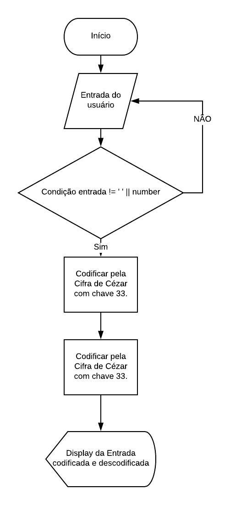

# cifra_de_cesar_ProdutoFinal

##Tarefas
  1. Solicitar palavra ao usuário: criar prompt;
  2. Usuário não pode deixar prompt vazio ou inserir número;

###Codificar string fornecida pelo usuário - Com Cifra de César e chave 33
    1. Criar a função cipher;
    2. Descobrir o número Ascii de cada letra da string = numberAscii;
    3. Descobrir o numero Ascii de cada letra codificada = codeNumberAscii;
    4. Retornar as letras codificadas = stringCode.

####Descodificar string codificada - Com Cifra de César e chave 33
        1. Criar a função decipher;
        2. Descobrir o número Ascii de cada letra da string = numberAscii;
        3. Descobrir o numero Ascii de cada letra descodificada = codeNumberAscii;
        4. Retornar as letras descodificadas = stringCode.
